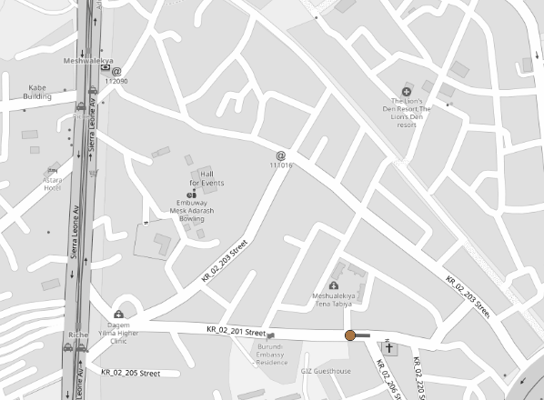
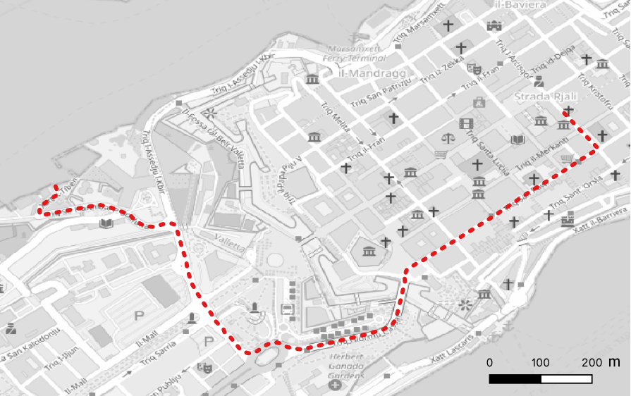

# routing_tutorial

This repo contains the code for a routing tutorial. We'll be starting with the setting up a local OSRM server using Docker.

If you don't know what Docker is or how to install it, please refer to the [documentation](https://docs.docker.com/desktop).




## Setting up OSRM in Ubuntu using Docker

Using Bash, navigate to a directory where you have permissions to read and write.

```bash
# create a directory for the data, suso su por superuser permissions
mkdir -p data/osrm/malta
cd /data/osrm/malta

# download the OSM data for Malta
wget https://download.geofabrik.de/europe/malta-latest.osm.pbf

# run the osrm-extract command to extract the data from the PBF file
docker run -t -v $(pwd):/data osrm/osrm-backend osrm-extract -p /opt/car.lua /data/malta-latest.osm.pbf

# run the osrm-partition command to partition the graph for faster routing
docker run -t -v $(pwd):/data osrm/osrm-backend osrm-partition /data/malta-latest.osrm

# run the osrm-customize command
docker run -t -v $(pwd):/data osrm/osrm-backend osrm-customize /data/malta-latest.osrm

# run the container
docker run -t -i -p 5000:5000 -v $(pwd):/data osrm/osrm-backend osrm-routed --algorithm mld /data/malta-latest.osrm
```

## Setting up OSRM in Windows

Please be sure that Docker us installed and working. Installing Docker in Windows systems may not be so straight-forward as installing it in Linux-based environments. **You'll also need to be running Docker Desktop**.

Using PowerShell, navigate to a directory where you have permissions to read and write.

We'll be using OSM data for the country of Malta, provided by Geofabrik as a PBF file. Download the file and place it in the directory you're working in.

```powershell
md -Force  C:\Users\guillermo\Documents\data\osrm\malta

cd C:\Users\guillermo\Documents\data\osrm\malta

curl.exe -O https://download.geofabrik.de/europe/malta-latest.osm.pbf
```

Now, we'll run the `osrm-extract` and several other commands to extract the data from the PBF file, generate the data for OSRM and partition it for faster routing. The graph will be generated using the car routing profile, there are other profiles available, but we'll stick with the default for now.

```powershell
# osrm-extract
docker run -t -v "$(pwd):/data" osrm/osrm-backend osrm-extract -p /opt/car.lua /data/malta-latest.osm.pbf

# osrm-partition
docker run -t -v "$(pwd):/data" osrm/osrm-backend osrm-partition /data/malta-latest.osrm

# osrm-customize
docker run -t -v "$(pwd):/data" osrm/osrm-backend osrm-customize /data/malta-latest.osrm

```
We're now ready to run the `docker run` command to start the OSRM server. We'll use the `-p` flag to expose port 5000 on the host machine, and the `-v` flag to mount the current directory as `/data` inside the container.

```powershell
# run the container
docker run -t -i -p 5000:5000 -v "$(pwd):/data" osrm/osrm-backend osrm-routed --algorithm mld /data/malta-latest.osrm
```

Since the exposed port is the 5000, you can check if the service is up by visiting this URL in your browser:
http://127.0.0.1:5000/

You should see a this message:

`{"message":"URL string malformed close to position 1: \"\/\"","code":"InvalidUrl"}`

A proper query for testing would be something like this:
http://127.0.0.1:5000/route/v1/driving/14.5035,35.8976;14.5144,35.8989?overview=full&geometries=geojson

The response is a JSON dictionary, that contains the calculated fastest route between the two input pair of coordinates, among other things.

You can also send a request to the server using `curl`:
```bash
curl "http://127.0.0.1:5000/route/v1/driving/14.5035,35.8976;14.5144,35.8989?overview=full&geometries=geojson"
```

You can visualize this in QGIS, using the following pyQGIS code, executed for the Python console:

```python
from qgis.core import (
    QgsProject, 
    QgsVectorLayer, 
    QgsFeature, 
    QgsGeometry, 
    QgsPointXY
)
import json
import urllib.request

URL = "http://127.0.0.1:5000/route/v1/driving/14.5035,35.8976;14.5144,35.8989?overview=full&geometries=geojson"


def load_route_from_osrm(url):
    """Fetch route from OSRM server and create a QGIS line layer"""  
    try:
        with urllib.request.urlopen(url) as response:
            data = json.loads(response.read().decode('utf-8'))
        
        if data.get('code') != 'Ok' or not data.get('routes'):
            print("Error: No valid route found in response")
            return None
            
        # Extract coordinates from the first route
        coordinates = data['routes'][0]['geometry']['coordinates']
        
        # Create memory layer
        layer = QgsVectorLayer("LineString?crs=EPSG:4326", "OSRM Route", "memory")
        provider = layer.dataProvider()
        
        # Create and add feature
        feature = QgsFeature()
        points = [QgsPointXY(lon, lat) for lon, lat in coordinates]
        feature.setGeometry(QgsGeometry.fromPolylineXY(points))
        provider.addFeature(feature)
        
        # Add to project and zoom
        QgsProject.instance().addMapLayer(layer)
        iface.mapCanvas().setExtent(layer.extent())
        iface.mapCanvas().refresh()
        
        print(f"Route loaded with {len(points)} points")
        return layer
        
    except Exception as e:
        print(f"Error: {str(e)}")
        return None

# Run the function
load_route_from_osrm(URL)
```

Example result:




## References

[Ruteo de alta perfomance con OSRM](https://rpubs.com/HAVB/osrm)

[Project OSRM](https://project-osrm.org/)


